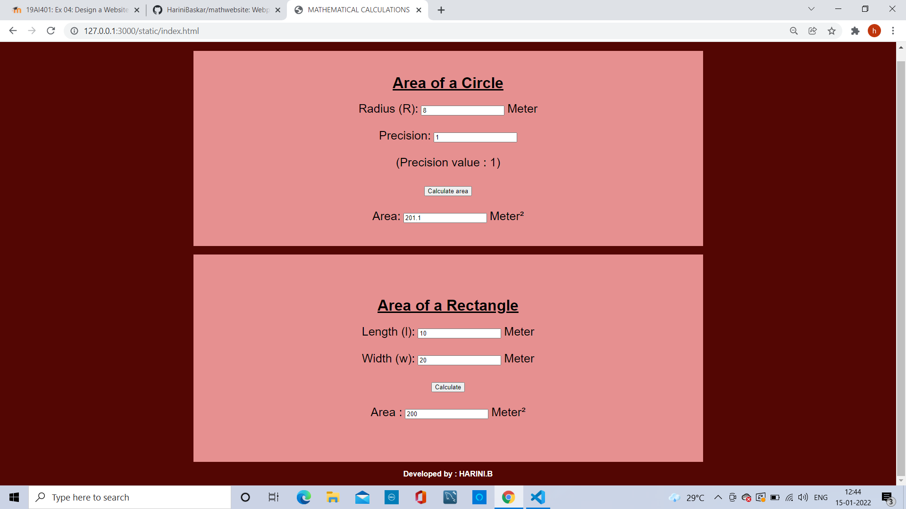
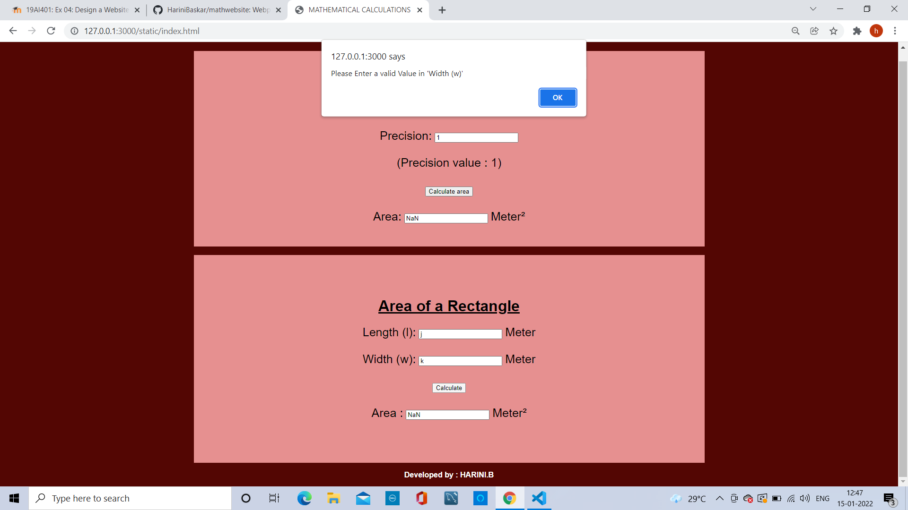

# Web Page for Mathematical Calculations

## AIM:

To design a static website with validation to perform mathematical calculations in client side.

## DESIGN STEPS:

### Step 1:

Requirement collection.

### Step 2:

Creating the layout using HTML and CSS.

### Step 3:

Write javascript to perform the calculations.

### Step 4:

Include regularexpression based input validation.

### Step 5:

Validate the layout in various browsers.

### Step 6:

Validate the HTML code.

### Step 6:

Publish the website in the given URL.

## PROGRAM :
```
<!DOCTYPE html>
<html lang="en">
<head>
    <meta charset="UTF-8">
    <meta http-equiv="X-UA-Compatible" content="IE=edge">
    <meta name="viewport" content="width=device-width, initial-scale=1.0">
    <title>MATHEMATICAL CALCULATIONS</title>
    <style>
        *{
            box-sizing: border-box;
            font-family: Arial, Helvetica, sans-serif;
        }
        body{
            background-color:#530603;
            color:black;
        }
        .container{
            width: 1080px;
            margin-left: auto;
            margin-right: auto;
            background-color: #530603;
            border:#880606;
        }
        .content{
            display: block;
            width: 100%;
            background-color:#e69090;
            margin-top: 40px;
            min-height: 400px;
        }
        .text{
            text-align: center;
            padding-top: 50px;
            text-decoration: underline;
        }
        .formelement{
            text-align: center;
            font-family: Georgia, 'Times New Roman', Times, serif;
            font-size: 25px;
            margin-top: 5px;
            margin-bottom: 5px;

        }
        .by{
            text-align: center;
            color: white;
            font-family: 'Gill Sans', 'Gill Sans MT', Calibri, 'Trebuchet MS', sans-serif
        }
    </style>

</head>
<body>
    <div class="container">
        <div class="content">
            <h1 class="text">Area of a Circle</h1>
            <form>
                <div class="formelement"><label for="radiusEdit">Radius (R):</label>
                    <input type="text" id="radiusEdit" value="0"/>
                    <lable for="radiusEdit">Meter</lable>
                </div>
                <br>
                <div class="formelement">
                    <label for="bEdit">Precision:</label>
                    <input type="text" id="bEdit" value="0"/><br><br>   
                    <div class="form">
                    <lable for="bEdit">(Precision value : 1)</lable>
                </div>
                </div>
                <br>
                <div class="formelement">
                    <input type="button" value="Calculate area" id="areaButton"/>
                </div>
                <br>
                <div class="formelement">
                    <label for="areaEdit">Area:</label>
                    <input type="text" id="areaEdit" value="0" readonly />
                    <label for="areaEdit">Meter²</label>
                </div>
                <br><br>
                <hr size="20" color=#530603> 
                <div class="body"></div>
                <div class="container">
                    <div class="content">
                        <h1 class="text">Area of a Rectangle</h1>
                        <form>
                            <div class=formelement>
                                <lable for="aedit">Length (l):</lable>
                                <input type="text" id="aedit" value="0"/>
                                <lable for="aedit">Meter</lable>
                            </div><br>
                            <div class=formelement>
                                <lable for="bedit">Width (w):</lable>
                                <input type="text" id="bedit" value="0"/>
                                <lable for="bedit">Meter</lable>
                            </div><br>
                            <div class=formelement>
                                <input type="button" value="Calculate" id="addbutton"/>
                            </div><br>
                            <div class=formelement>
                                <lable for="cedit">Area :</lable>
                                <input type="text" id="cedit" readonly="0"/>
                                <lable for="cedit">Meter²</lable>
                            </div><br><br>
                              </div>
                        </form>
                    </div>
                </div>
            </form>
        </div>
    </div>
        </div>
    </div>
    <script type="text/javascript">
        var button;
        button = document.querySelector("#areaButton");
        button.addEventListener("click",function(){
            var aText,bText,cText;
            var aVal,bVal,cVal;
            var sum1
            var radiusEdit,reg,res;
            sum1=document.querySelector("#radiusEdit");
            radiusEdit = sum1.value;
            reg = new RegExp("^[1-9]+[0-9]*$");
            res = radiusEdit.match(reg);
            if(res==null)
            {
                alert("Please Enter a valid Value in 'Radius (R)' ");
            }
            
            var sum
            var bEdit,reg,res;
            sum=document.querySelector("#bEdit");
            bEdit = sum.value;
            reg = new RegExp("^[1]+[1]*$");
            res = bEdit.match(reg);
            if(res==null)
            {
                alert("Please Enter a valid 'Precision' Value");
            }
            
            
            try{
            aText=document.querySelector("#radiusEdit");
            bText=document.querySelector("#bEdit");
            cText=document.querySelector("#areaEdit");

            aVal = parseInt(aText.value);
            bVal = parseInt(bText.value)
            cVal = (22/7)*aVal*aVal;
            cText.value = ""+cVal.toFixed(bVal);
            }catch(e1){
                
            }
            
        });

        var button;
     
    button=document.querySelector("#addbutton");
    button.addEventListener("click",function(){
        
        var atext,btext,ctext;
        var aval,bval,cval
        var sum2
            var aedit,reg,res;
            sum2=document.querySelector("#aedit");
            aedit = sum2.value;
            reg = new RegExp("^[1-9]+[0-9]*$");
            res = aedit.match(reg);
            if(res==null)
            {
                alert("Please Enter a valid Value in 'Length (l)' ");
            }
            
            var sum3
            var bedit,reg,res;
            sum3=document.querySelector("#bedit");
            bedit = sum3.value;
            reg = new RegExp("^[1-9]+[0-9]*$");
            res = bedit.match(reg);
            if(res==null)
            {
                alert("Please Enter a valid Value in 'Width (w)' ");
            }
           
        atext=document.querySelector("#aedit");
        btext=document.querySelector("#bedit");
        ctext=document.querySelector("#cedit");

        aval=parseInt(atext.value);
        bval=parseInt(btext.value);
        cval=aval*bval;
        ctext.value=""+cval;

    });
    </script>
    <footer> <p class="by"><B>Developed by : HARINI.B </B></p></footer>
</body>
</html>
```
## OUTPUT:

### VALIDATION:





## Result:

Thus a website is designed to perform mathematical calculations in the client side.
